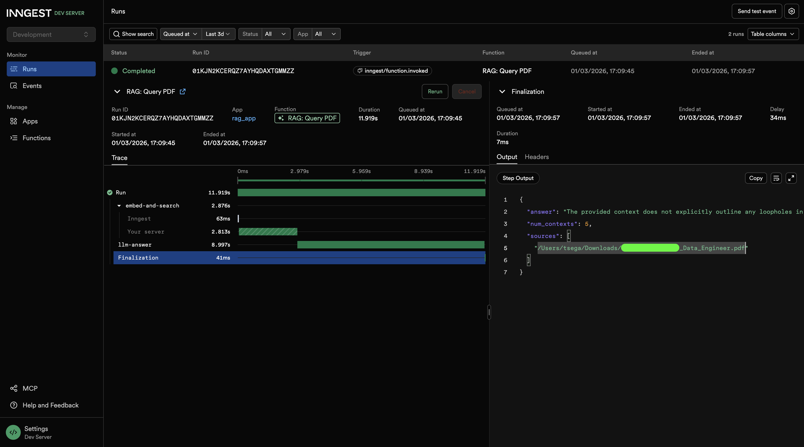

# RAG Production App

A production-ready Retrieval-Augmented Generation (RAG) pipeline built with FastAPI, Inngest, Qdrant, and OpenAI.

## What it does

- **Ingest PDFs**: Loads a PDF, chunks it, embeds the chunks using OpenAI, and stores them in a Qdrant vector database.
- **Query PDFs**: Embeds a question, searches Qdrant for relevant context, and uses GPT-4o-mini to generate a grounded answer.

Both operations run as durable background functions via [Inngest](https://www.inngest.com/).

## Demo



## Stack

- **FastAPI** — HTTP server
- **Inngest** — durable background job orchestration
- **Qdrant** — vector database
- **OpenAI** — embeddings (`text-embedding-3-large`) and LLM (`gpt-4o-mini`)
- **LlamaIndex** — PDF loading and text chunking

## Setup

1. Install dependencies:
   ```bash
   uv sync
   ```

2. Create a `.env` file:
   ```
   OPENAI_API_KEY=your_key_here
   ```

3. Start Qdrant locally (via Docker):
   ```bash
   docker run -p 6333:6333 qdrant/qdrant
   ```

4. Start the app:
   ```bash
   uv run uvicorn main:app
   ```

5. Start the Inngest dev server:
   ```bash
   npx inngest-cli@latest dev
   ```

## Inngest Events

### Ingest a PDF

**Event:** `rag/ingest_pdf`

```json
{
  "name": "rag/ingest_pdf",
  "data": {
    "pdf_path": "/path/to/file.pdf"
  }
}
```

### Query

**Event:** `rag/query_pdf_ai`

```json
{
  "name": "rag/query_pdf_ai",
  "data": {
    "question": "What is the document about?"
  }
}
```
